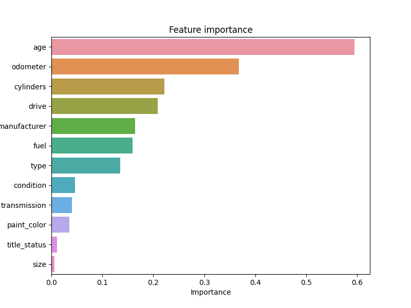

## Practical Application Assignment 11

## Overview

The provided dataset contains information on 426K cars to ensure speed of processing.  Your goal is to understand what factors make a car more or less expensive.  

As a result of your analysis, you should provide clear recommendations to your client -- a used car dealership -- as to what consumers value in a used car.

## Business understanding

The goal of this analysis is to understand the features that contributes in higher importance to a used car price. 

By using a provided car dataset of about  426,000 used cars, performed an in-depth examination and modeling to evaluate and inference the elements that make a car gives its value. 

The results of this analysis will help an used car dealership to have better understanding about customer preferences.

In any business, pricing is a very important factor. Any business wants to optimize their inventories and pricing strategies to attract consumers.

This analysis can serve for the dealership to make more informed decisions regarding the vehicles the trade in. 

This could potentially increase their profitability and customer satisfaction.

## Data Set Used And Detailed Analysis taken

The dataset is an extract of 426,880 used cars from Craigslist (from a 3 million record source). 

Each row represents a car, and each column represents an attribute of the car. 

The dataset contains the following attributes:

    1. region        : Craigslist region where the car is being sold
    2. price         : advertised price of the car
    3. year          : model year of the car
    4. manufacturer  : manufacturer name 
    5. model         : model name 
    6. condition     : condition of the car (excellent, good, like new, etc.)
    7. cylinders     : number of cylinders
    8. fuel          : fuel type (gas, diesel, etc.)
    9. odometer      : number of miles the car has been driven
    10. title_status  : title status (clean, missing, etc.)
    11. transmission  : transmission type (automatic, manual, etc.)
    12. VIN           : vehicle identification number
    13. drive         : drive type (fwd, rwd, etc.)
    14. size          : size of the car (compact, mid-size, etc.)
    15. type          : type of the car (SUV, sedan, etc.)
    16. paint_color   : color of the car
    17. state         : state where the car is being sold

More detail from the Exploratory Data Analysis, Data Preparation, Model Building and Evaluation is found here: Details [Notebook](./mauricio_prompt_II.ipynb)

## Findings

## Key Findings

1. **Age of the Car**: This feature is significant to define the price. The older the car is, the less it's worth.

2. **Odometer (Mileage)**: Cars with less mileage usually have a better condition and longer lifespan, making them more valuable.

3. **Number of Cylinders**: A car's price can be influenced by the number of cylinders it has. Cars with more cylinders typically have stronger engines, which can be appealing to some customers.

4. **Drive Type**: Whether a car is front-wheel, rear-wheel, or four-wheel drive can affect its price. Depending on the local climate and customer preferences, certain drive types may be more popular.

5. **Fuel Type**: The fuel type a car uses plays a role in its price. With an increasing trend towards eco-friendly vehicles, hybrid and electric cars could command higher prices.

6. **Manufacturer**: The brand or manufacturer of a car also matters. Cars from manufacturers known for quality, reliability, or luxury can often be sold for higher prices.

7. **Car Type**: The style of the car, whether it's an SUV, sedan, truck, etc., can influence its price. Understanding the demand for different types of cars in your market could help you optimize your inventory.

8. **Condition**: As expected, a car in excellent condition is generally more valuable. The better the condition, the higher the price it can command.

9. **Paint Color, Transmission, Size and Title Status**: While less influential, still contribute to its overall value.

By understanding these factors, you can make strategic decisions in selecting and pricing cars for your dealership in order to help your profitability.

This analysis is just the starting point, and it concentrates on the relationship between car descriptions and their prices. 

Given more comprehensive data or a larger dataset, we could enhance both the precision and utility of our model. It might also be beneficial to extend the analysis to include other business aspects like sales conditions and customer information, along other features along the way.

Our model could benefit from an enhanced data preparation phase. This could involve pulling more detailed information from the Vehicle Identification Number (VIN), which might allow us to more accurately determine factors such as the number of cylinders, vehicle size, fuel type, and transmission type. Additionally, securing information about the original price of the car could be helpful in assessing its depreciation rate.

Increasing the amount of data fed into the model could lead to longer training times but also potentially improve its performance. This might involve incorporating previously discarded features like the car model and region, utilizing a larger dataset, or integrating data from other sources such as the Kelly Blue Book.

Furthermore, collecting data related to dealership operations, like sales time frames, numbers of vehicles sold, current inventory size, and others, could be beneficial. This additional data could enable us to provide better advice on optimizing your inventory management.
